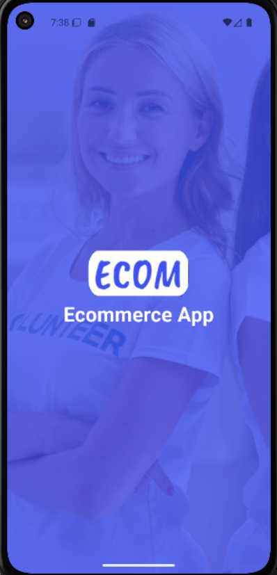
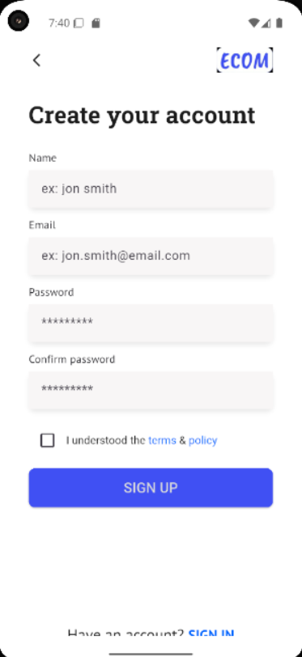
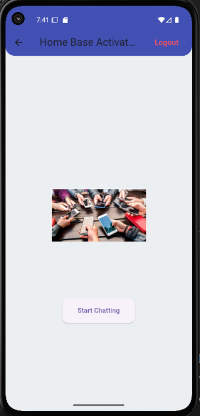

🛒 ***E-Commerce App — Authentication Feature***

Version: v2 — Authentication Integration
Tech Stack: Flutter · Dart · BLoC · Clean Architecture · REST API v2


📸 ***Screenshots****

##Splash Screen




##Sign In


    
##Sign Up


##Home


✨ Features
🔑 User Authentication — Register, log in, and log out securely.

📱 Splash Screen — Smooth branded intro screen.

👤 Sign In Page — User credentials validation and API login.

📝 Sign Up Page — Registration form with error handling.

🏠 Home Page — Shows authentication status once logged in.

🛡 API v2 Integration — Access to products only after authentication.

🏗 Clean Architecture — Modular and scalable code structure.

🗂 ***Project Structure***

```
lib
┣ 📂core
┃ ┣ 📂error/
┃ ┣ 📂network
┃ ┣ 📂storage/
┃ ┣ 📂themes/
┃ ┣ 📂usecases/
┃ ┗ 📂utils/
┣ 📂features
┃ ┗ 📂auth
┃   ┣ 📂data
┃   ┃ ┣ 📂datasources/
┃   ┃ ┣ 📂models/
┃   ┃ ┗ 📂repositories/
┃   ┣ 📂domain
┃   ┃ ┣ 📂entities/
┃   ┃ ┣ 📂repositories/
┃   ┃ ┗ 📂usecases/
┃   ┣ 📂managers/
┃   ┗ 📂presentation/
┃     ┣ 📂bloc/
┃     ┣ 📂pages/
┃     ┗ 📂widgets/
┣ 📜injection_container.dart
┗ 📜main.dart
```

🧠 Clean Architecture Overview
Domain Layer

LoginUsecase

SignupUsecase

LogoutUsecase

Data Layer

Remote Datasource: Auth API requests

Local Datasource: Token storage (Hive)

Repository Implementations

Presentation Layer

BLoC State Management


Installation

Clone the repository:

```
git clone https://github.com/game-ale/2025-A2SV-G6-mobile-assessment.git
cd 2025-A2SV-G6-mobile-assessment\Gamechu_Alemu\Chat_app

```
Install dependencies:

```
flutter pub get

```
Run the app:

```
flutter run

```